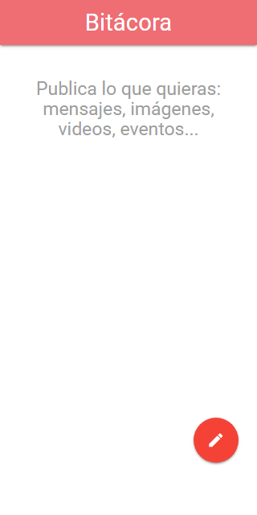
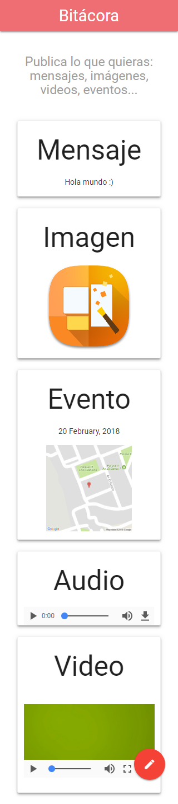

# FLASH-BITÁCORA

* **Track:** _FRONT-END-DEVELOPER_
* **Curso:** _Construye una Single Page App (spa) multi-usuario consumiendo data remota_
* **Unidad:** _5_

***

## Introducción 

Esta es una aplicación que ofrece al usuario agregar mensajes, imágenes, eventos (con localización), audios y videos en una bitácora.

## Plan de trabajo

El proyecto se desarrolló en dos y se crearon los siguientes issues y milestones que sirven como hoja de ruta (roadmap):

* Inicializar el proyecto con babel, servidor, jquery, materialize. 
* Primer maquetado.
* Funcionalidad "Agregar mensaje".
* Funcionalidad "Agregar imágenes".
* Funcionalidad "Agregar evento y localización".
* Funcionalidad "Agregar audio y video".
* Elaborar readme.

## Archivos importantes

El proyecto presenta los siguientes archivos para uso del usuario:

* `README.md` con descripción de la aplicación, uso y ejemplo.
* `index.js`: Archivo js que contiene la funcionalidad de la aplicación.
* `index.html`: Página web de la aplicación.

## Especificaciones

* Se utilizaron las últimas actualizaciones de HTML5 (File API, Geolocation API, Audio y Vídeo, Date input).
* Se utilizó la librería jQuery en su versión 3.2.1 
* Se utilizó el framework materialize en su versión 0.100.2.
* Se utilizó el estándar más recientemente aceptado de JavaScript ES2015 || ES6.
* Se utilizó el transpilador/compilador Babel para que convierta nuestro código en ES5 de forma automática.
* Se utilizó el servidor de node.js.
* Mobile first.

***

## Uso
* Se muestra un botón rojo que, al sobreponer el cursor sobre él, se despliega una serie de opciones (mensaje, imágenes, audio, eventos y videos). Al dar click sobre cada una de las opciones, se muestra un modal en donde el usuario puede introducir el tipo de contenido seleccionado.
* A continuación se agrega el contenido a la vista principal.

## Ejemplo

* Vista principal del proyecto:

* Vista con diferentes tipos de contenido:

***

## Autoras

* Rocci Escobar Nuñez [Cuenta GitHub](https://github.com/Rocciescobar "Repositorio")
* Manuela Flores Vilchez [Cuenta GitHub ](https://github.com/ManuelaFlores "Repositorio")
